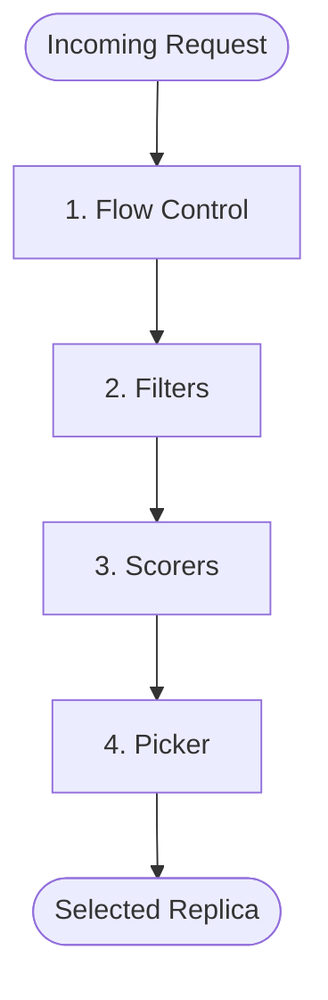

# Scheduler Customization Guide

This guide explains how the `py-inference-scheduler` engine works and how you can customize its behavior by designing custom **Scheduler Profiles** in your `scheduler.yaml`.

---

## 1. Scheduling Pipeline Architecture

The scheduler uses a modular pipeline to make routing decisions for each incoming request. A **Scheduler Profile** defines the specific plugins used at each stage of this pipeline:


*   **Flow Control**: Blocks or throttles routing to a replica that doesn't meet flow control policy.
*   **Filters**: Eliminate replicas that do not meet hard constraints (e.g., matching model names, healthy status).
*   **Scorers**: Assign a numerical score to each remaining replica. Multiple scorers can be combined with weights. The scheduler normalizes scores to `[0, 1]` before applying weights.
*   **Picker**: Selects a single replica from the scored candidates. By default, it picks the highest-scoring replica.

---

## 2. YAML Configuration Schema

The scheduler is configured via a `scheduler.yaml` file. 

*   **Reference Example**: For a production-ready reference, see [scheduler.yaml](../integration/verl/examples/scheduler.yaml).

### Schema Template

```yaml
profile_handler:
  type: <profile_handler_type_name>
  # (Optional config parameters for the handler)

profiles:
  <profile_name>:
    # (Optional) Filters run sequentially to eliminate replicas.
    # Omit if you do not need hard filtering.
    filters:
      - type: <filter_type_name>
        # (Filter-specific parameters)
        
    # Scorers assign normalized, weighted scores to remaining replicas.
    # While technically optional, a profile should typically have at least one scorer.
    scorers:
      - type: <scorer_type_name>
        weight: <float>
        # (Scorer-specific parameters)
        
    # (Optional) Custom picker to choose the final replica from scored candidates.
    # If omitted, the scheduler defaults to selecting the highest-scoring replica.
    picker:
      type: <picker_type_name>
      # (Picker-specific parameters)
      
    # (Optional) Flow control plugins to budget resources and prevent saturation.
    # Omit if you do not want flow-control/preemption gating.
    flow_controls:
      - type: <flow_control_type_name>
        # (Flow-control-specific parameters)
```

---

## 3. Built-in Plugin Reference

### Profile Handlers (for P/D Disaggregation)
Profile Handlers determine which profile(s) to run for a given request.
*   **`single_profile`**: The default handler. It simply runs all defined profiles and returns the first one that successfully selects an endpoint.

### Filters
Filters eliminate replicas based on hard rules.
*   **`simple`**: Keeps only replicas that have a specific attribute matching a target value.
    *   `key` (string, required): The attribute key to check (e.g., `"model_name"`).
    *   `value` (object, optional): The value to match. If omitted, it acts as a no-op.

### Scorers
Scorers assign scores to replicas. Multiple scorers are normalized and weighted.

#### A. Backpressure-Based (Discourages routing to overloaded replicas)
*   **`least_queue`**: Scores replicas based on their active Ray Serve queue length. Encourages routing to replicas with the fewest active requests.
*   **`waiting_queue`**: Scores replicas based on the number of *waiting* requests in the vLLM engine.
*   **`running_queue`**: Scores replicas based on the number of *running* requests in the vLLM engine.
*   **`kv_cache`**: Scores replicas based on physical KV cache memory utilization. Encourages routing to replicas with more free KV cache.
*   **`queue_length`**: A generic scorer that reads a custom attribute.
    *   `attribute_key` (string, default: `"waiting_queue_size"`): The attribute to read.

#### B. Cache-Based (Encourages routing to maximize cache hits)
*   **`prefix_cache`**: Scores replicas based on how much of the request's prompt matches the prefix cache already loaded on the replica. Crucial for maximizing vLLM/SGLang chunked prefix cache hits.
    *   `block_size` (int, default: `64`): Token block size for hashing.
    *   `max_prefix_blocks` (int, default: `256`): Max blocks to index.
    *   `lru_capacity_per_server` (int, default: `31250`): Cache capacity per replica.

#### C. Generic Scorers (for benchmarking against current RL sampling routing)
*   **`round_robin`**: Cycles through replicas sequentially.
*   **`constant`**: Assigns a static score to all replicas.
    *   `value` (float, required): The score to assign.

### Pickers
Pickers choose the final replica from the scored list.
*   **`max_score`**: Always selects the replica with the highest combined score (default).
*   **`random`**: Introduces entropy by picking randomly from the top $N$ replicas.
    *   `max_num` (int, default: `1`): The size of the top-candidate pool to pick from.

### Flow Control (Gatekeeping)
Flow control plugins prevent replica overload and mid-decoding preemptions by controlling the flow to affected replicas.
*   **`kv_saturation`**: Estimates the KV cache impact of incoming requests. If routing a request to a replica would exceed its physical KV cache capacity (causing vLLM to preempt/drop other active requests), it blocks admission.
    *   `enable_drip` (bool, default: `false`): Enables slow "drip" admission when all replicas are saturated, rather than blocking completely.
    *   `drip_threshold_kv` (float, default: `0.1`): Max physical KV utilization for drip eligibility.
    *   `drip_interval_s` (float, default: `2.0`): Minimum time between drip admissions.
    *   `default_osl` (int, default: `1024`): Default output sequence length estimate used before stats are learned.
    *   *More Info*: For a detailed deep-dive into how KV saturation budgeting works and its mathematical model, see the [KV Saturation Guide](./kv_saturation.md).

---

## 4. Example Configuration

Here is an example of a sophisticated `scheduler.yaml` that combines prefix caching, backpressure scoring, and KV saturation protection:

```yaml
profile_handler:
  type: single_profile

profiles:
  hybrid_policy:
    scorers:
      # Heavily favor prefix cache hits for speed
      - type: prefix_cache
        weight: 10.0
        block_size: 64
      # Secondarily favor replicas with lower KV cache utilization
      - type: kv_cache
        weight: 3.0
      # Trivial backpressure check
      - type: least_queue
        weight: 1.0
    picker:
      type: max_score
    flow_controls:
      # Protect against KV saturation and preemption storms
      - type: kv_saturation
        enable_drip: true
        drip_threshold_kv: 0.15
        default_osl: 512
```
